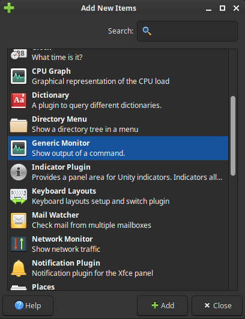
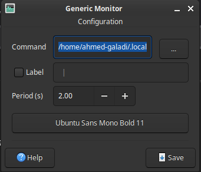

# Terminal-based System Monitor Panel Widget

A minimal, fast system monitor written in **C**, designed to run inside the **XFCE panel** using the **Genmon plugin**.

It displays real-time CPU usage, temperature, RAM usage, disk usage, and minimal progress bars — all rendered as plain text for maximum performance and zero bloat.

---

## Preview


> *(Final result inside the XFCE top bar)*

---

## Features

- Written entirely in **C**
- Extremely low CPU & memory usage
- Designed for **XFCE Genmon**
- Colored output with clear thresholds
- Minimalistic text-based progress bars
- No background daemon
- No unnecessary dependencies

---

## Requirements

- Linux
- GCC
- Make
- XFCE desktop
- `xfce4-genmon-plugin` (recommended)

---

## Installation

### 1. Clone the repository

```bash
git clone https://github.com/Ahmed-Galadi/Terminal-based-system-monitor-panel-widget.git
cd Terminal-based-system-monitor-panel-widget
```

### 2. Run the installer

```bash
chmod +x install.sh
./install.sh
```

The installer will:
- Compile the program
- Install it to `~/.local/bin`
- Clean build files

No `sudo` required.

---

## XFCE Panel Integration (Genmon)

### Install Genmon

```bash
sudo apt install xfce4-genmon-plugin
```

### Add to panel

1. Right-click the XFCE panel
2. Panel → Add New Items
3. Select Generic Monitor
4. Click [+ Add] Button



- You will find it on the top bar like this :


1. Right Click on (genmon)XXX
2. Click on Properties

### Configure Genmon

- Command: `/home/your-user/.local/bin/MONITOR` 
- Update interval: `2`
- Click Save



---

## Manual Usage

```bash
MONITOR
```

---

## Uninstall

```bash
rm ~/.local/bin/MONITOR
```

---

## License

MIT License

---

## Author

Ahmed Galadi  
1337 Coding School
